# Guida al pannello di amministrazione

Questa guida spiega come gestire il sito **ICS Basketball School** dal pannello riservato, sezione per sezione.

> Gli screenshot usano dati di esempio: nomi, iscrizioni e foto non sono reali.

## Indice

1. [Accesso](#1-accesso)
2. [Come funziona il pannello](#2-come-funziona-il-pannello)
3. [Panoramica](#3-panoramica)
4. [Testi del sito](#4-testi-del-sito)
5. [News](#5-news)
6. [Eventi](#6-eventi)
   - [Mettere un evento nel menu del sito](#mettere-un-evento-nel-menu-del-sito)
7. [Iscrizioni](#7-iscrizioni)
8. [Staff](#8-staff)
9. [Documenti](#9-documenti)
10. [Galleria](#10-galleria)
11. [Uso da smartphone](#11-uso-da-smartphone)
12. [Domande frequenti](#12-domande-frequenti)

---

## 1. Accesso

Il pannello si apre all’indirizzo **`/admin`** (ad esempio `https://www.icsbasketballschool.it/admin`) oppure dal link **Area riservata** nel fondo di ogni pagina del sito.

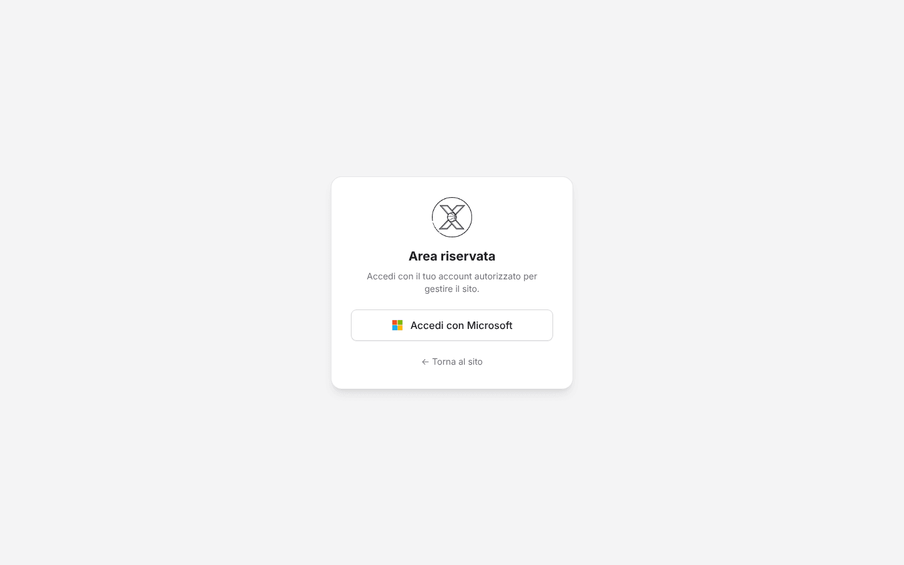

- Clicca **Accedi con Microsoft** e usa il tuo account autorizzato.
- Se compare *“Accesso non autorizzato”*, il tuo account non ha ancora il ruolo di amministratore: chiedi a chi gestisce il sito di invitarti (vedi [Gestire gli amministratori](../../README.md#gestire-gli-amministratori)).
- Per uscire usa **Esci** in fondo al menu laterale.

## 2. Come funziona il pannello

**Menu laterale.** A sinistra trovi tutte le sezioni; la voce attiva è evidenziata in arancione. In fondo ci sono il link **↗ Vedi il sito** (si apre in una nuova scheda), l’account con cui sei entrato e **Esci**.

**Schede.** Le pagine più ricche (Testi del sito, Eventi) sono divise in schede orizzontali: passare da una scheda all’altra **non** perde le modifiche, che restano in attesa del salvataggio.

**Salvataggio.** Appena modifichi qualcosa compare in basso la barra **“Hai modifiche non salvate”**:

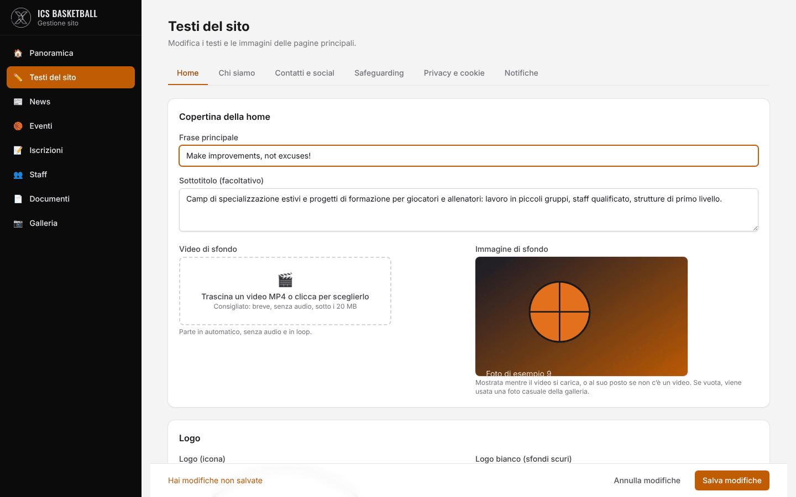

- **Salva modifiche** pubblica subito i cambiamenti sul sito.
- **Annulla modifiche** riporta tutto all’ultima versione salvata.
- Se provi a lasciare la pagina senza salvare, il pannello chiede conferma.
- Dopo ogni salvataggio compare un avviso verde in basso a destra; in caso di errore un avviso rosso spiega cosa non va.

**Modifiche contemporanee.** Se due persone modificano la stessa sezione nello stesso momento, chi salva per secondo riceve un avviso: ricarica la pagina, rifai la modifica e salva di nuovo. Nessun dato viene sovrascritto per errore.

**Editor di testo.** I testi lunghi usano un editor con la barra: **B** grassetto, *I* corsivo, U sottolineato, titoli H2/H3, elenchi puntati e numerati, citazione, link, annulla/ripeti. Puoi incollare testo da Word o da un’email: vengono mantenuti solo gli stili supportati dall’editor.

**Immagini.** Trascina un’immagine nel riquadro o cliccalo per sceglierla dal computer. Le foto vengono ridimensionate e ottimizzate automaticamente prima del caricamento: non serve prepararle.

## 3. Panoramica

È la pagina iniziale del pannello.

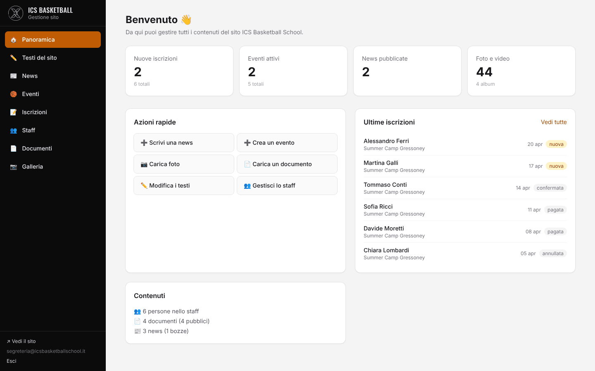

- **Contatori in alto**: nuove iscrizioni da gestire, eventi pubblicati, news pubblicate e numero di foto/video. Cliccando un riquadro si va alla sezione corrispondente.
- **Azioni rapide**: scorciatoie per le operazioni più frequenti (scrivere una news, creare un evento, caricare foto o documenti…).
- **Ultime iscrizioni**: le sei richieste più recenti con il loro stato (`nuova` è evidenziata in giallo).
- **Contenuti**: riepilogo di staff, documenti e news in bozza.

## 4. Testi del sito

Contiene i testi fissi del sito, divisi in sei schede.

### Home

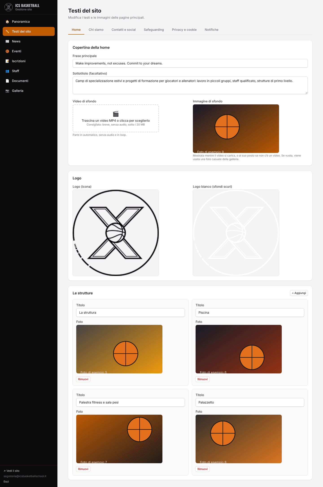

- **Frase principale** e **Sottotitolo** della copertina.
- **Video di sfondo** (MP4, breve, senza audio, sotto i 20 MB): parte in automatico e in loop.
- **Immagine di sfondo**: mostrata mentre il video si carica, o al suo posto. Se vuota viene usata una foto casuale della galleria.
- **Logo** (icona) e **Logo bianco** per gli sfondi scuri.
- **Le strutture**: schede con titolo e foto (struttura, piscina, palestra…). Usa **+ Aggiungi** / **Rimuovi**.

### Chi siamo
Titolo e testo della sezione “Chi siamo”, fino a 4 foto mostrate in home e il testo introduttivo dei **servizi di supporto** (psicologo, nutrizionista, osteopata: le loro schede si gestiscono in [Staff](#8-staff), gruppo “Supporto”).

### Contatti e social

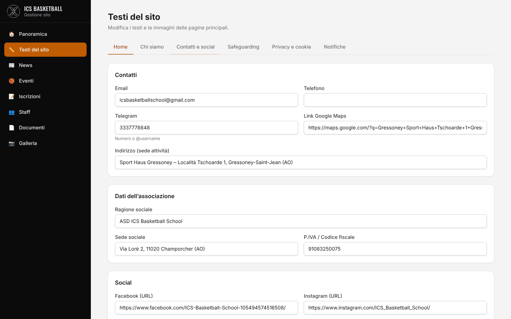

Email, telefono, Telegram, indirizzo e link Google Maps; dati dell’associazione (ragione sociale, sede, P.IVA/CF) mostrati nel piè di pagina; link ai profili social. Lasciando vuoto un social, l’icona non viene mostrata.

### Safeguarding
Testo della sezione Safeguarding. I documenti della categoria **Safeguarding** (sezione [Documenti](#9-documenti)) vengono elencati automaticamente sotto il testo.

### Privacy e cookie
Testi delle pagine `/privacy` e `/cookie-policy`.

### Notifiche

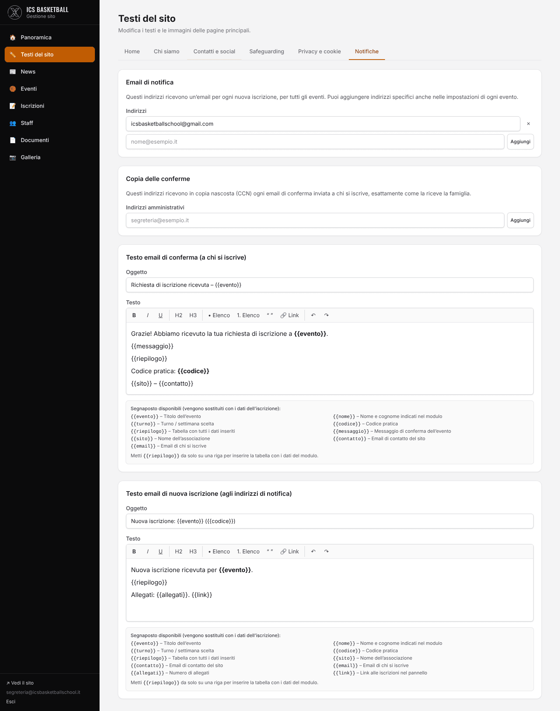

- **Email di notifica**: ricevono un avviso per ogni nuova iscrizione, per tutti gli eventi. Scrivi l’indirizzo e premi **Aggiungi**; la ✕ lo rimuove.
- **Copia delle conferme**: ricevono in copia nascosta (CCN) l’email di conferma inviata alla famiglia, identica all’originale.
- **Testo delle email**: oggetto e testo dell’email di conferma (a chi si iscrive) e di quella di nuova iscrizione (alla segreteria). I **segnaposto** tra doppie graffe, come `{{evento}}` o `{{codice}}`, vengono sostituiti con i dati reali; `{{riepilogo}}`, da solo su una riga, inserisce la tabella con tutti i dati del modulo. **Ripristina testo predefinito** annulla le personalizzazioni.

## 5. News

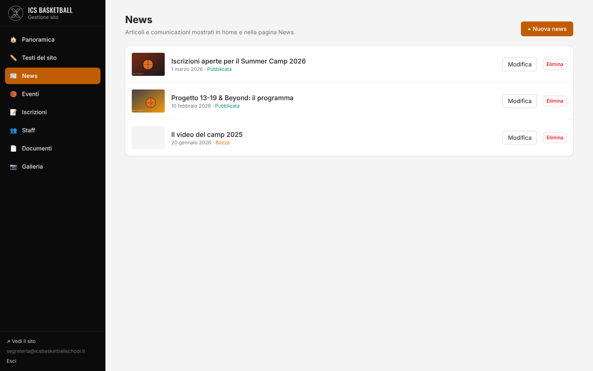

L’elenco mostra tutte le news, dalla più recente, con lo stato **Pubblicata** o **Bozza**. Usa **+ Nuova news** per scriverne una, **Modifica** per cambiarla, **Elimina** per cancellarla (viene chiesta conferma).

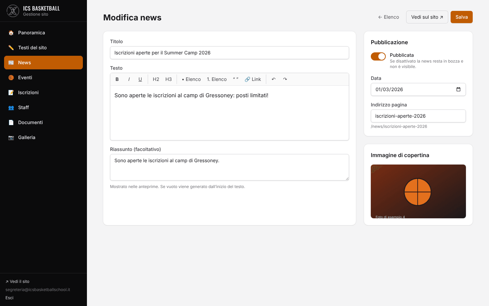

- **Titolo** e **Testo** dell’articolo.
- **Riassunto**: mostrato nelle anteprime; se lo lasci vuoto viene preso l’inizio del testo.
- **Pubblicazione**: l’interruttore **Pubblicata** decide se la news è visibile; la **Data** determina l’ordine; l’**Indirizzo pagina** è generato dal titolo (es. `/news/iscrizioni-aperte-2026`).
- **Immagine di copertina**: usata nell’anteprima e in cima all’articolo.
- In alto: **Vedi sul sito ↗** apre la news pubblicata, **Salva** salva.

## 6. Eventi

Ogni evento (camp, corso, progetto) ha una pagina propria, il modulo d’iscrizione, i documenti e gli album collegati.

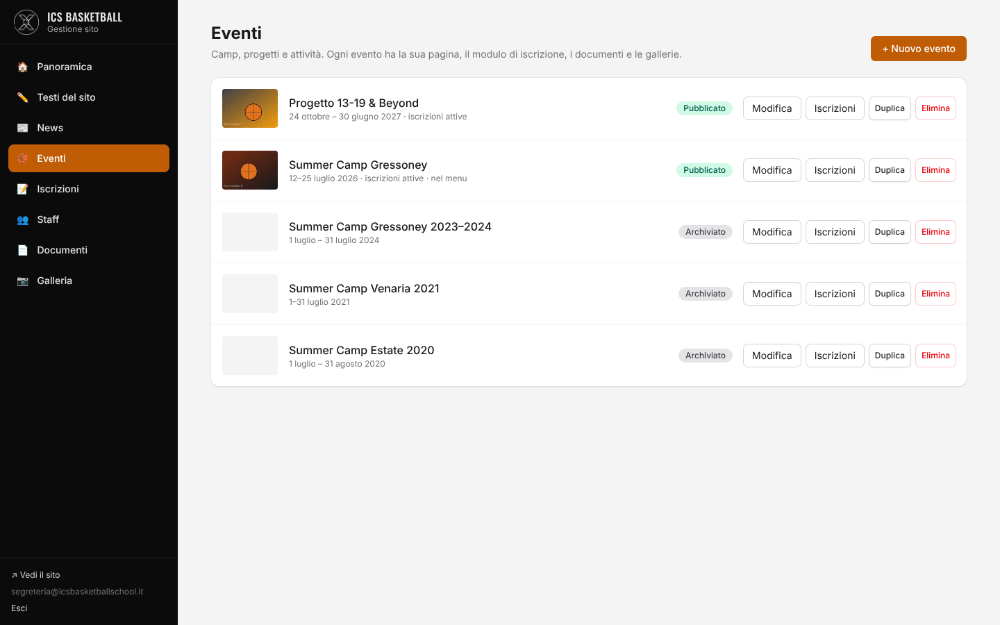

Per ogni evento vedi le date, lo stato (**Bozza**, **Pubblicato**, **Archiviato**) e le indicazioni *iscrizioni attive* e *nel menu*. I pulsanti:

- **Modifica** apre la scheda dell’evento.
- **Iscrizioni** apre le iscrizioni già filtrate per quell’evento.
- **Duplica** crea una copia in bozza: comodo per preparare l’edizione dell’anno successivo mantenendo turni, quote, programma e modulo.
- **Elimina** cancella l’evento (le iscrizioni ricevute restano archiviate).

La scheda dell’evento è divisa in sei schede. Il pulsante **Salva** in alto (o la barra in basso) salva tutte le schede insieme.

### Generale

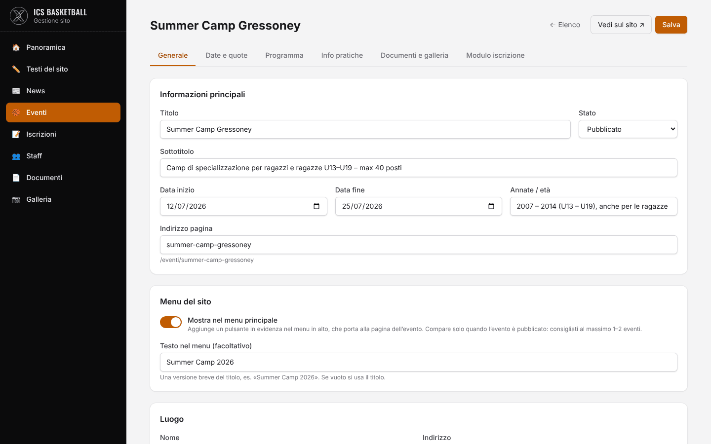

- **Titolo**, **Sottotitolo**, **Data inizio/fine**, **Annate / età**.
- **Stato**:
  - *Bozza*: non visibile sul sito, per prepararlo con calma;
  - *Pubblicato*: visibile tra gli eventi in corso, con iscrizioni se attive;
  - *Archiviato*: visibile tra gli eventi passati, senza iscrizioni.
- **Indirizzo pagina**: la parte finale dell’URL, es. `/eventi/summer-camp-gressoney`. Cambiarlo rende non più valido il vecchio link.
- **Menu del sito**: vedi il paragrafo seguente.
- **Luogo** (nome, indirizzo, link Google Maps), **Immagini** (copertina e locandina) e **Presentazione**.

### Mettere un evento nel menu del sito

Un evento può comparire come **pulsante arancione nel menu principale** del sito, accanto alle voci Chi siamo, Eventi, News…: è il modo più veloce per spingere le iscrizioni a un camp.

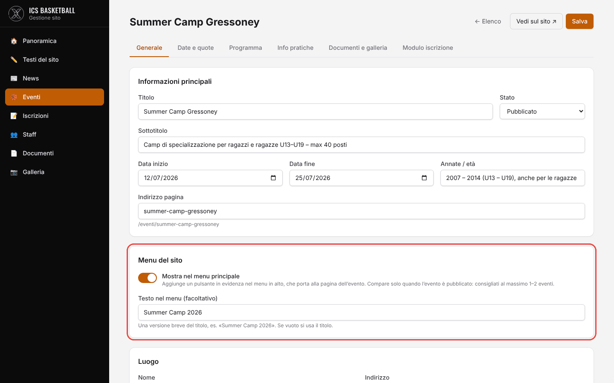

1. Apri l’evento da **Eventi → Modifica**, scheda **Generale**.
2. Nel riquadro **Menu del sito** attiva **Mostra nel menu principale**.
3. Facoltativo: in **Testo nel menu** scrivi un’etichetta breve (es. *Summer Camp 2026*). Se lo lasci vuoto si usa il titolo dell’evento.
4. Controlla che lo **Stato** sia *Pubblicato* e premi **Salva**.

Il risultato sul sito, su computer:

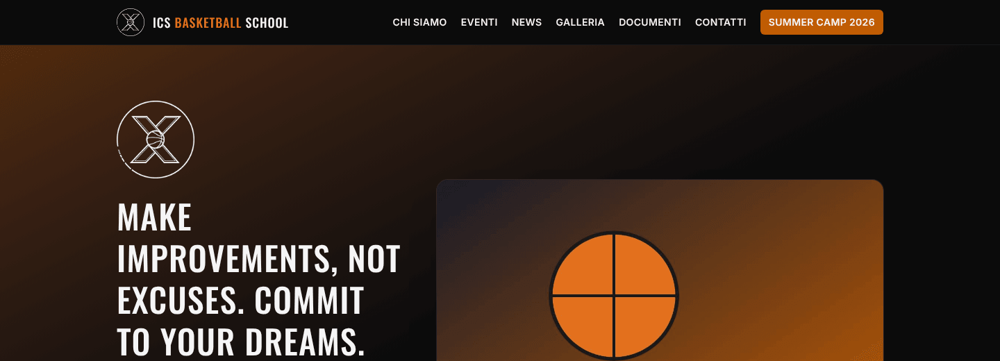

e su smartphone, dentro il menu ☰ (in arancione, dopo le altre voci):

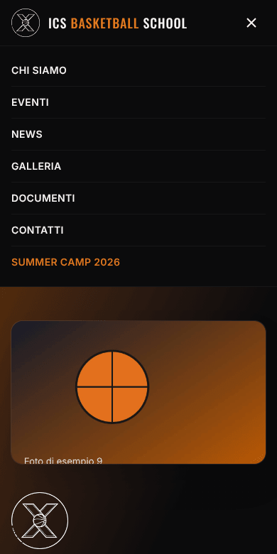

Da sapere:

- Il link compare **solo se l’evento è pubblicato**. Se l’evento è in bozza o archiviato il pannello lo segnala con un avviso giallo, e il link resta nascosto finché non lo pubblichi.
- Puoi mettere più eventi nel menu: vengono mostrati in ordine di data di inizio. Per non affollare la barra ne consigliamo **al massimo 1–2**.
- Su computer il pulsante appare dagli schermi larghi (portatili e monitor); sugli schermi più stretti e sui telefoni è nel menu ☰.
- Per toglierlo basta disattivare l’interruttore e salvare. Nell’elenco eventi gli eventi nel menu sono indicati con *nel menu*.
- Quando duplichi un evento la copia nasce in bozza, quindi non compare nel menu finché non la pubblichi.

### Date e quote

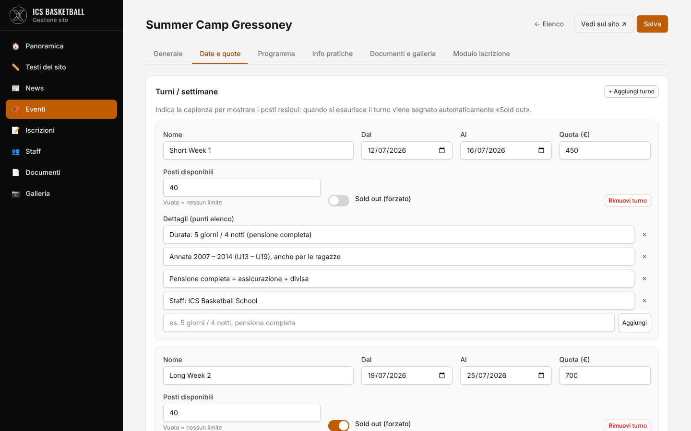

- **Turni / settimane**: nome, date, quota, **posti disponibili** (vuoto = senza limite) e dettagli in punti elenco. Quando i posti finiscono il turno viene segnato *Sold out* automaticamente; l’interruttore **Sold out (forzato)** lo chiude a mano.
- **Quote e supplementi**: voci di prezzo aggiuntive con importo e note.
- **Cosa è incluso**, **Pagamento** (IBAN, causale, acconto e saldo), **Sconti**, **Recesso e rimborsi**.

### Programma

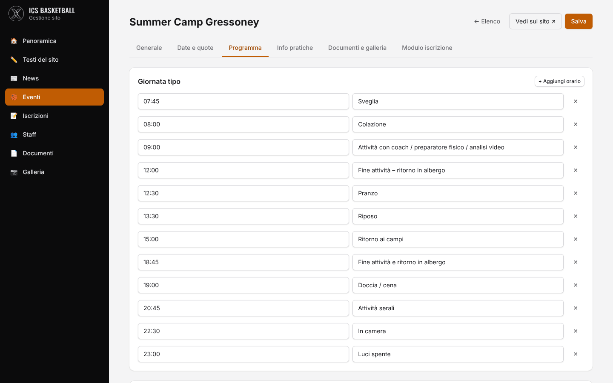

La **giornata tipo** (orario + attività, con **+ Aggiungi orario**), le **modalità di partecipazione** e la descrizione delle **strutture**.

### Info pratiche

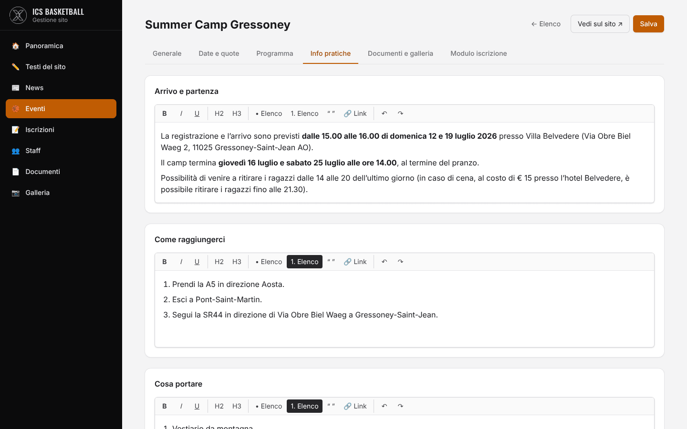

Arrivo e partenza, come raggiungerci, cosa portare, documenti da inviare. Le sezioni lasciate vuote non compaiono sulla pagina dell’evento.

### Documenti e galleria

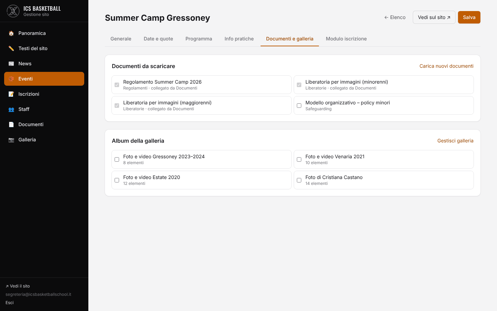

Spunta i **documenti** da mostrare nella pagina dell’evento e gli **album** della galleria da collegare. Quelli già associati all’evento dalle sezioni Documenti o Galleria sono spuntati e non modificabili qui.

### Modulo iscrizione

- **Iscrizioni aperte**: mostra il pulsante *Iscriviti* sulla pagina dell’evento (l’evento deve essere pubblicato).
- **Apertura / Chiusura** facoltative: fuori da queste date il modulo non è disponibile. La chiusura vale fino alla fine del giorno indicato.
- **Istruzioni** mostrate sopra il modulo (bonifico, IBAN, causale…), **testo del consenso privacy** e **messaggio di conferma** (mostrato dopo l’invio e nell’email).
- **Email da avvisare per questo evento**: si aggiungono a quelle generali della scheda *Notifiche*.

**Campi del modulo**

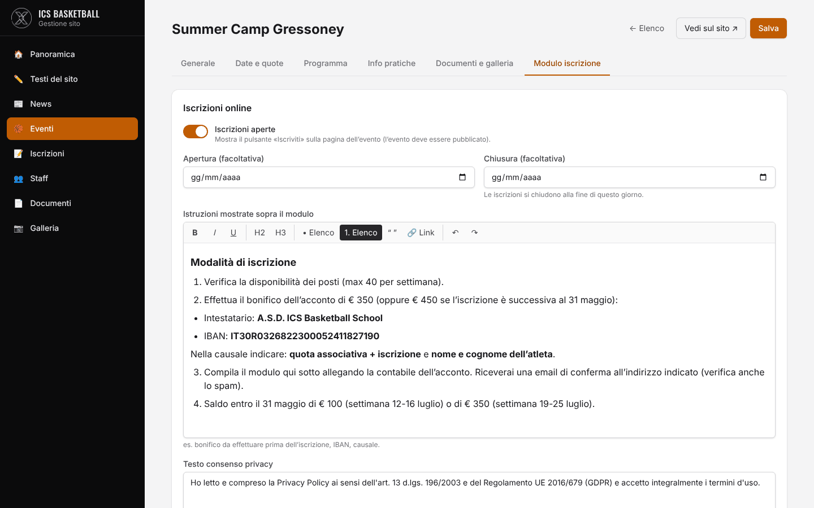

Ogni campo ha un’etichetta, un tipo, una sezione (es. *1) Dati atleta*) e un testo di aiuto facoltativo; la spunta **Obbligatorio** lo rende necessario, le frecce ↑ ↓ ne cambiano l’ordine. Tipi disponibili:

| Tipo | Uso |
|---|---|
| Testo breve / Testo lungo | nomi, indirizzi, note |
| Email, Telefono, Data | con controllo del formato |
| Menu a tendina, Scelta singola | opzioni separate da virgola (es. `S, M, L, XL`) |
| Casella di spunta | consensi, conferme |
| Allegato (PDF/immagine) | ricevuta del bonifico, certificato medico… |
| Scelta del turno/settimana | elenca i turni della scheda *Date e quote* e controlla i posti |

**Usa modello standard** sostituisce i campi con il modulo tipico (turno, dati atleta, ricevuta, dati genitore).

## 7. Iscrizioni

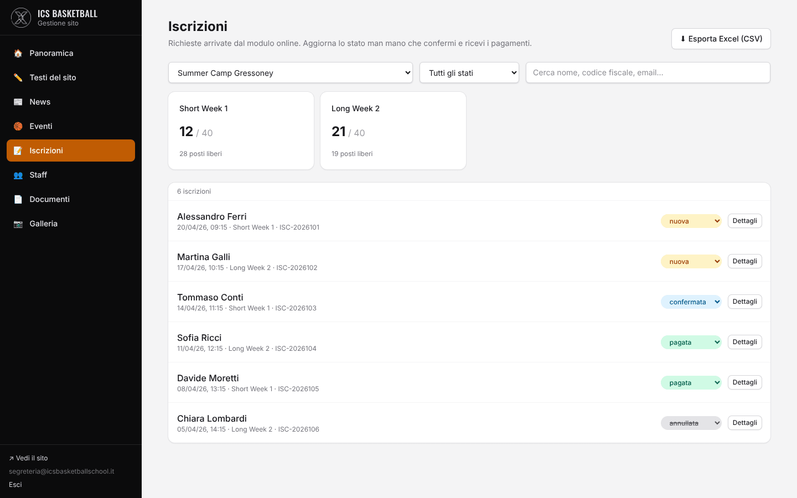

- In alto filtra per **evento** e per **stato**, oppure cerca per nome, codice fiscale o email.
- Scelto un evento, compaiono i **posti occupati** per ogni turno (gli annullati non contano) e il pulsante **⬇ Esporta Excel (CSV)** per scaricare l’elenco completo.
- Lo **stato** si cambia direttamente dal menu colorato della riga: `nuova` → `confermata` → `pagata`, oppure `annullata` (libera il posto).

Cliccando **Dettagli** si apre la scheda completa:

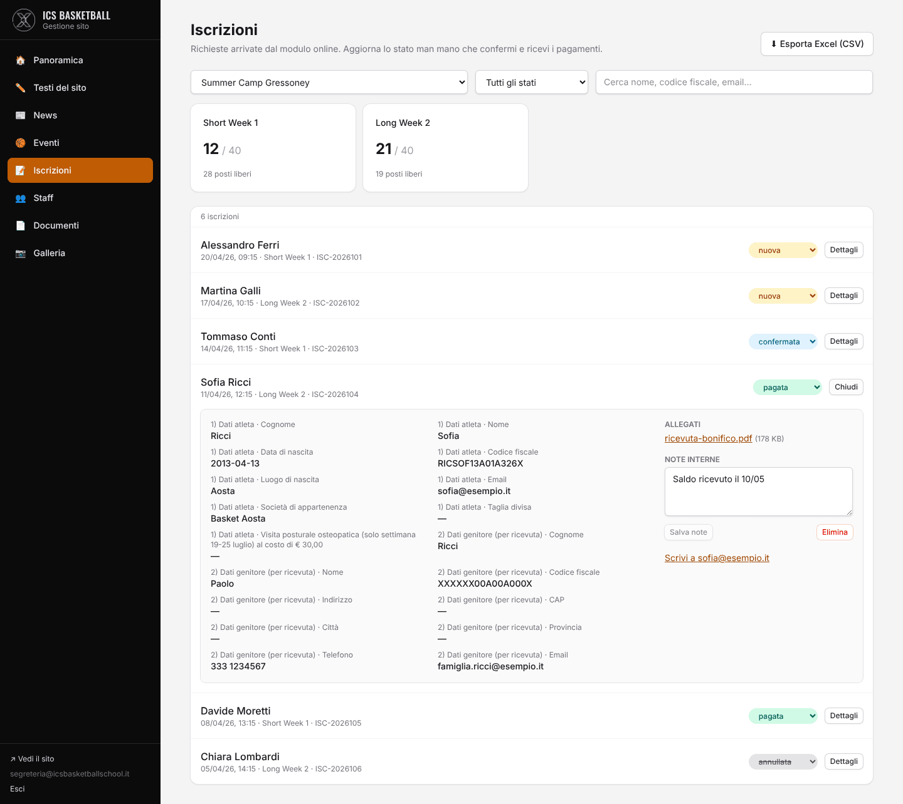

- tutti i dati inseriti nel modulo, divisi per sezione;
- gli **allegati** (si aprono con un link sicuro valido pochi minuti);
- le **note interne**, visibili solo nel pannello (ricorda **Salva note**);
- **Scrivi a…** apre un’email al contatto dell’iscrizione;
- **Elimina** cancella definitivamente l’iscrizione e i suoi allegati.

## 8. Staff

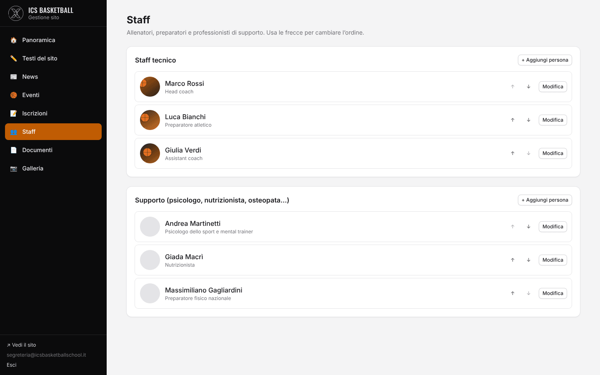

Le persone sono divise in **Staff tecnico** e **Supporto** (psicologo, nutrizionista…). Le frecce ↑ ↓ cambiano l’ordine di visualizzazione sul sito; **+ Aggiungi persona** crea una nuova scheda.

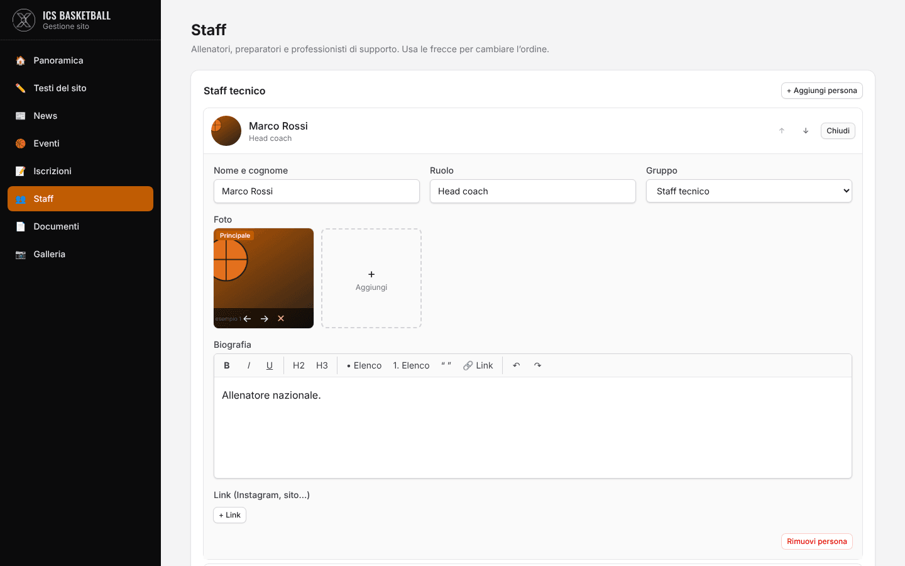

Cliccando **Modifica** si apre la scheda: nome, ruolo, gruppo, **foto** (la prima è la principale; le frecce sulla miniatura cambiano l’ordine), biografia e link (Instagram, sito…). Ricorda di salvare con la barra in basso.

## 9. Documenti

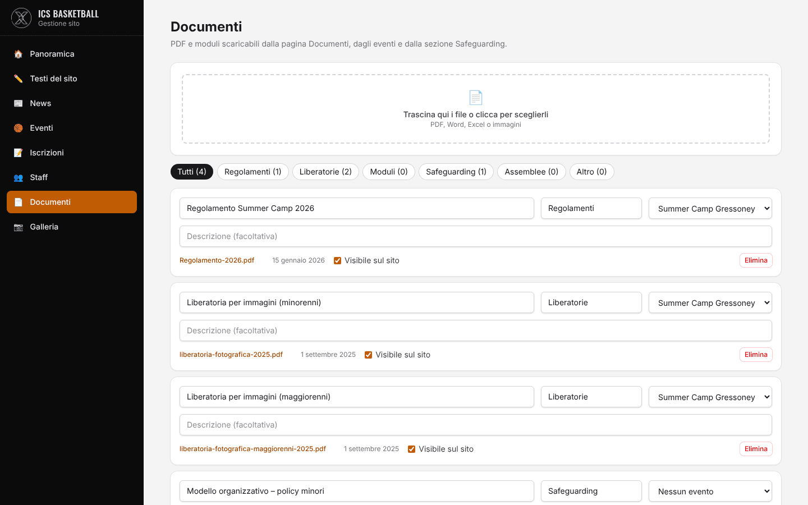

- Trascina i file (PDF, Word, Excel o immagini) nel riquadro in alto per caricarli.
- I filtri per **categoria** (Regolamenti, Liberatorie, Moduli, Safeguarding, Assemblee, Altro) aiutano a ritrovarli.
- Per ogni documento puoi cambiare titolo, categoria, descrizione ed **evento collegato** (il documento compare nella pagina di quell’evento).
- **Visibile sul sito**: se disattivato il documento resta nel pannello ma non appare nella pagina Documenti.
- **Elimina** cancella definitivamente il file.

## 10. Galleria

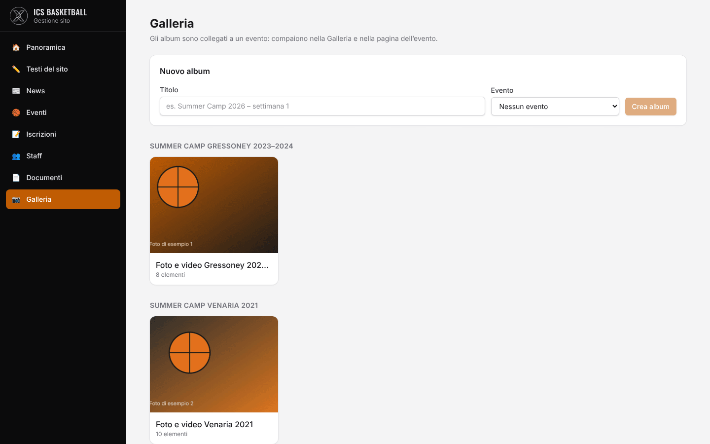

Gli album sono raggruppati per evento. Per crearne uno, compila **Nuovo album** (titolo ed evento collegato). Gli album nascosti sono segnalati con *nascosto*.

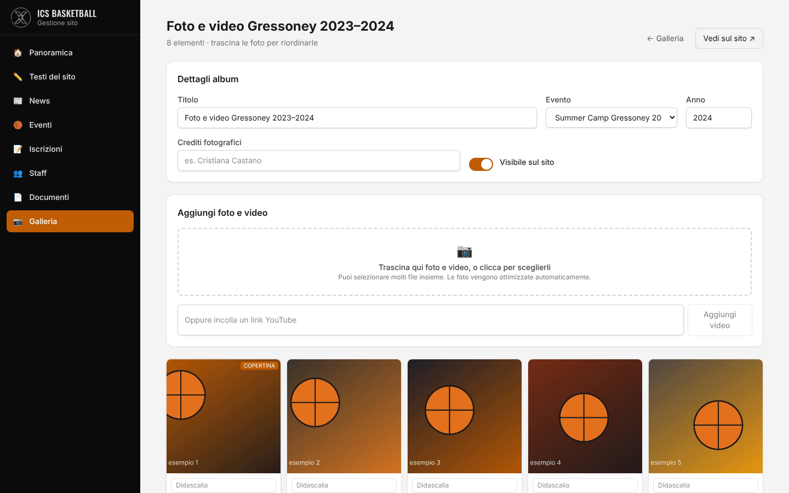

- **Dettagli album**: titolo, evento, anno, crediti fotografici e **Visibile sul sito**.
- **Aggiungi foto e video**: trascina molti file insieme; le foto vengono ottimizzate automaticamente. Puoi anche incollare un **link YouTube**.
- Trascina le miniature per riordinarle, scrivi una didascalia sotto ciascuna, scegli quale usare come **copertina**.
- **Elimina album** cancella l’album e tutte le sue foto (operazione non reversibile).

## 11. Uso da smartphone

Il pannello funziona anche da telefono: il menu laterale si apre con il pulsante ☰ in alto a sinistra.

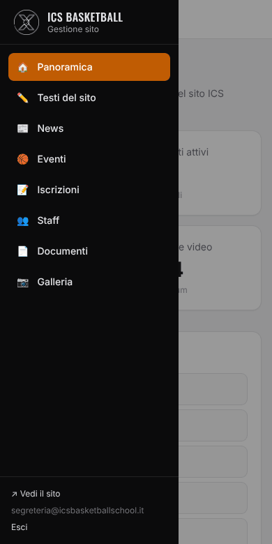

## 12. Domande frequenti

**Ho salvato ma sul sito non vedo la modifica.**
Ricarica la pagina del sito. Se si tratta di un evento o di una news, verifica che siano *Pubblicati*.

**Il pulsante dell’evento non compare nel menu.**
Controlla che *Mostra nel menu principale* sia attivo, che l’evento sia *Pubblicato* e di aver salvato. Su computer serve una finestra abbastanza larga: altrimenti il link è nel menu ☰.

**Come preparo il camp dell’anno prossimo?**
In **Eventi** usa **Duplica** sull’evento di quest’anno, aggiorna date, turni e quote nella copia, poi pubblicala. Archivia l’evento vecchio.

**Una famiglia non ha ricevuto l’email di conferma.**
Verifica l’indirizzo nel dettaglio dell’iscrizione e chiedi di controllare lo spam. Se hai impostato la *Copia delle conferme* (Testi del sito → Notifiche), puoi inoltrare la tua copia.

**Ho ricevuto l’avviso che qualcun altro ha modificato i dati.**
Ricarica la pagina, rifai la modifica e salva di nuovo.
